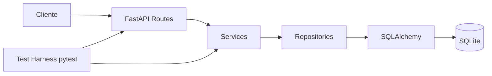

# Especificação Técnica - SDD

## 1. Problema
Pequenas equipes frequentemente recebem solicitações de suporte por mensagens e planilhas, o que dificulta rastreabilidade, prioridade, responsabilidade e acompanhamento. O SGC centraliza chamados por meio de uma API REST simples e testável.

### Público afetado
Equipes pequenas de suporte e usuários internos que precisam registrar solicitações.

### Objetivo
Permitir registro, consulta e acompanhamento controlado de chamados, com regras explícitas de status e prioridade.

### Escopo
Inclui criação, listagem, consulta individual, alteração de status, prioridade e responsável. Não inclui autenticação, notificações ou dashboard nesta entrega inicial.

## 2. Requisitos funcionais
| ID | Descrição | Critério de aceite |
|---|---|---|
| RF01 | Criar chamado com título, descrição e prioridade. | POST válido retorna 201 e status inicial ABERTO. |
| RF02 | Listar chamados. | GET retorna 200 e lista ordenada por ID, inclusive vazia. |
| RF03 | Consultar chamado por ID. | Existente retorna 200; inexistente retorna 404. |
| RF04 | Alterar status. | Transição permitida retorna 200; inválida retorna 409. |
| RF05 | Alterar prioridade. | Chamado aberto/não encerrado aceita prioridade válida. |
| RF06 | Atribuir responsável. | Chamado aberto/não encerrado aceita nome válido. |
| RF07 | Validar entradas. | Dados inválidos retornam 422 sem persistir registro inválido. |

## 3. Requisitos não funcionais
| ID | Descrição | Critério verificável |
|---|---|---|
| RNF01 | Reprodutibilidade | Aplicação e testes devem poder ser executados via Docker. |
| RNF02 | Testabilidade | Regras críticas devem possuir testes automatizados. |
| RNF03 | Manutenibilidade | Separação entre rotas, serviço, repositório, schemas e modelo. |
| RNF04 | Portabilidade | Stack baseada em Python 3.12 e dependências declaradas. |
| RNF05 | Observabilidade mínima | Endpoint `/health` deve indicar disponibilidade da API. |
| RNF06 | Documentação | README deve conter instalação, execução e harness. |

## 4. Regras de negócio
| ID | Regra |
|---|---|
| RN01 | Status inicial de todo chamado é ABERTO. |
| RN02 | ABERTO pode mudar apenas para EM_ANDAMENTO ou CANCELADO. |
| RN03 | EM_ANDAMENTO pode mudar apenas para RESOLVIDO ou CANCELADO. |
| RN04 | RESOLVIDO e CANCELADO são estados finais. |
| RN05 | Chamado encerrado não pode ter prioridade ou responsável alterados. |
| RN06 | Prioridade deve ser BAIXA, MEDIA, ALTA ou CRITICA. |
| RN07 | Título deve possuir 3 a 120 caracteres e descrição 5 a 2000. |

## 5. Contratos de entrada/saída
### POST /chamados
Entrada: `{ "titulo": string, "descricao": string, "prioridade": "BAIXA|MEDIA|ALTA|CRITICA" }`.
Sucesso: 201 com chamado criado. Erro de validação: 422.

### GET /chamados
Entrada: nenhuma. Sucesso: 200 com lista de chamados.

### GET /chamados/{id}
Sucesso: 200. Recurso inexistente: 404.

### PATCH /chamados/{id}/status
Entrada: `{ "status": "ABERTO|EM_ANDAMENTO|RESOLVIDO|CANCELADO" }`.
Sucesso: 200. Transição inválida: 409. ID inexistente: 404. Valor inválido: 422.

### PATCH /chamados/{id}/prioridade
Entrada: `{ "prioridade": "BAIXA|MEDIA|ALTA|CRITICA" }`.
Sucesso: 200. Chamado encerrado: 409. ID inexistente: 404.

### PATCH /chamados/{id}/responsavel
Entrada: `{ "responsavel": string }` com 2 a 120 caracteres.
Sucesso: 200. Chamado encerrado: 409. ID inexistente: 404. Valor inválido: 422.

## 6. Decomposição em unidades
- **Routes:** expõem os contratos HTTP.
- **Schemas:** validam entrada e saída.
- **Services:** concentram regras de negócio.
- **Repositories:** isolam acesso ao banco.
- **Models:** representam persistência SQLAlchemy.
- **Database:** configura engine/sessões.
- **Tests:** validam requisitos e regras de forma isolada e integrada.

## 7. Arquitetura

A arquitetura em camadas reduz acoplamento e permite testar regras sem misturar responsabilidades.
